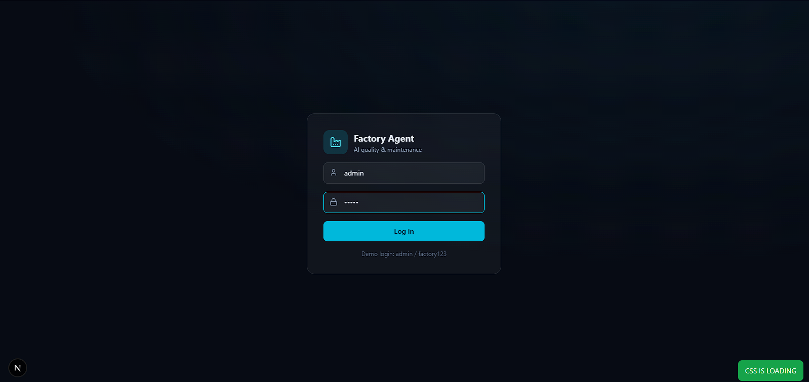
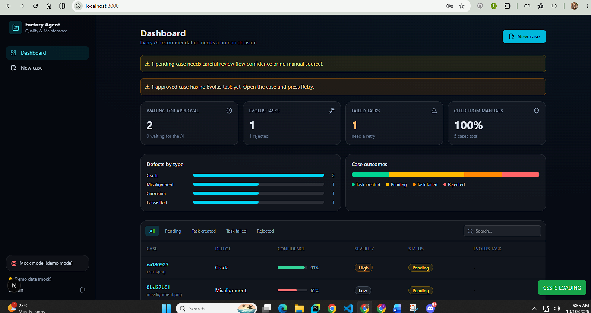
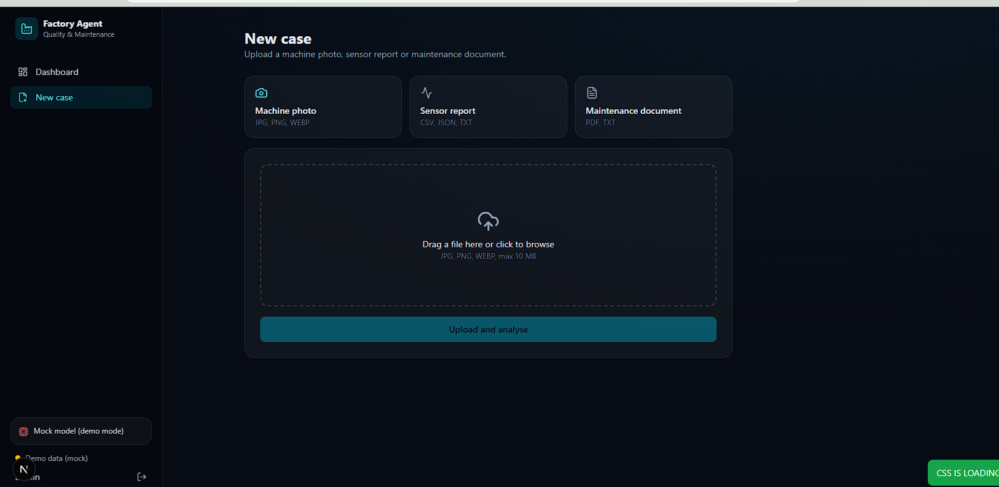
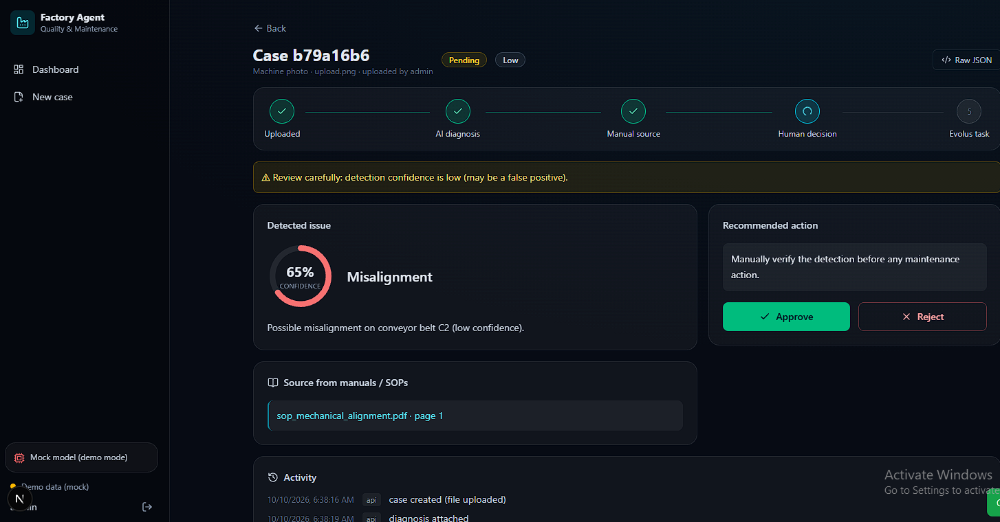
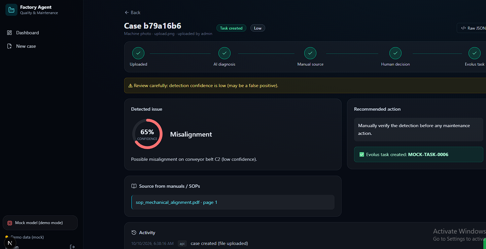

# AI Factory Quality & Maintenance Agent

> **Track:** Intelligent Industry  
> **Hackathon:** AMD Developer Hackathon — ACT III  
> **Project type:** AI-assisted factory quality inspection and maintenance workflow

An AI-powered factory quality and maintenance assistant designed to identify potential product defects, retrieve relevant Standard Operating Procedures (SOPs), recommend corrective actions, obtain human approval, and create traceable maintenance or quality tasks through Evolus.

The project combines a web-based factory dashboard, a backend API, computer vision, LLM-powered reasoning, document retrieval, human-in-the-loop approval, and maintenance task management.

**Current status:** Frontend prototype and mock-data workflow are available. Integration of the real computer-vision model, complete agent pipeline, persistent case management, and Evolus task creation must be verified and completed before claiming a fully functional end-to-end system.

---

## Table of Contents

1. [Project Overview](#1-project-overview)
2. [Problem Statement](#2-problem-statement)
3. [Project Objectives](#3-project-objectives)
4. [Complete System Workflow](#4-complete-system-workflow)
5. [Application Screenshots](#5-application-screenshots)
6. [Frontend Pages and Their Responsibilities](#6-frontend-pages-and-their-responsibilities)
7. [System Architecture](#7-system-architecture)
8. [Technology Stack](#8-technology-stack)
9. [Repository Structure](#9-repository-structure)
10. [Running the Frontend Locally](#10-running-the-frontend-locally)
11. [Environment Configuration](#11-environment-configuration)
12. [Mock Data and Demo Mode](#12-mock-data-and-demo-mode)
13. [Backend and AI Agent Integration](#13-backend-and-ai-agent-integration)
14. [Image Detection and AMD Integration](#14-image-detection-and-amd-integration)
15. [LLM, SOP Retrieval, and Agent Workflow](#15-llm-sop-retrieval-and-agent-workflow)
16. [Human Approval and Evolus Task Integration](#16-human-approval-and-evolus-task-integration)
17. [What the Team Should Do Next](#17-what-the-team-should-do-next)
18. [Open Questions for the Team](#18-open-questions-for-the-team)
19. [Current Limitations](#19-current-limitations)
20. [Security Considerations](#20-security-considerations)
21. [Contribution and Git Workflow](#21-contribution-and-git-workflow)

---

## 1. Project Overview

Manufacturing environments require timely identification of product defects, access to the correct repair procedures, and reliable tracking of corrective actions.

The AI Factory Quality & Maintenance Agent aims to connect these activities in one workflow.

An authorized factory employee uploads an inspection image. The backend processes the image using a computer-vision model, retrieves relevant SOP documentation, and coordinates an AI agent that prepares a recommendation. A human reviewer evaluates the evidence and approves or rejects the proposed action. Following approval, the system creates a maintenance or quality task through the Evolus integration.

The frontend provides a unified interface for viewing inspection cases, examining findings, reviewing recommendations, approving or rejecting actions, and tracking task status.

### Core capabilities

- Factory quality dashboard and case overview.
- Inspection image submission.
- Computer-vision-based defect detection.
- LLM-assisted defect explanation and corrective-action recommendations.
- SOP retrieval and evidence-grounded responses.
- Human-in-the-loop approval.
- Maintenance or quality task creation through Evolus.
- Case status tracking and task traceability.
- Mock-data mode for frontend development and hackathon demonstrations.

The exact availability of each capability depends on the implementation and integration status of the corresponding backend component.

## 2. Problem Statement

Traditional factory inspection and maintenance workflows can involve disconnected tools, manual document searches, delayed communication, and limited traceability between detected defects and corrective actions.

The proposed system aims to reduce this fragmentation by connecting image inspection, SOP retrieval, AI-assisted recommendations, human approval, and maintenance task creation in one traceable workflow.

## 3. Project Objectives

1. Provide a centralized interface for factory quality cases.
2. Allow employees to submit inspection images and supporting information.
3. Identify potential defects using a computer-vision model.
4. Retrieve relevant SOPs and generate evidence-based recommendations.
5. Keep a human reviewer in control of consequential actions.
6. Create an Evolus maintenance or quality task only after authorized approval.
7. Maintain a traceable relationship between the original inspection, the recommendation, the approval decision, and the resulting task.
8. Support rapid frontend development through mock data while real services are being integrated.

## 4. Complete System Workflow

The intended end-to-end workflow is described below.

### Step 1 — Upload an inspection image

An employee opens the Upload page and submits an image of a potentially defective product, component, or machine area.

Supporting information may include:

- Product or component identifier.
- Production line or machine identifier.
- Short description of the suspected problem.
- Inspection priority or additional context, if supported.

**Output:** An inspection case containing the submitted image and relevant metadata.

### Step 2 — Create and register the case

The frontend sends the submission to the backend API.

The backend validates the request, assigns a case identifier, and records the case. Image storage and database persistence must be configured by the backend implementation.

**Output:** A case ID that can be used to retrieve and track the inspection.

### Step 3 — Detect potential defects

The backend passes the image to the configured computer-vision model.

The model may return:

- Defect labels.
- Confidence scores.
- Bounding-box coordinates or segmentation masks, depending on the model.
- Additional metadata required by the application.

**Output:** Structured detection results associated with the case.

### Step 4 — Retrieve relevant SOP documentation

The agent uses the detection results and case context to retrieve relevant passages from the factory's Standard Operating Procedures, maintenance manuals, or quality-control documentation.

The retrieved material should support the recommendation rather than merely provide generic advice.

**Output:** Relevant SOP passages and their source references.

### Step 5 — Generate an AI recommendation

An LLM-based agent receives the structured detection results, case context, and retrieved documentation.

It prepares a structured response containing:

- A summary of the suspected defect.
- Supporting detection evidence.
- Relevant SOP references.
- Proposed corrective actions.
- Uncertainties and additional checks, where necessary.

The agent should distinguish model predictions from confirmed findings and should not invent unsupported procedures.

**Output:** A proposed corrective action ready for human review.

### Step 6 — Request human approval

The case detail page presents the evidence and recommendation to an authorized reviewer.

The reviewer can approve or reject the proposed action. Approval must be enforced by the backend, not just represented by a frontend button.

**Output:** A recorded approval decision.

### Step 7 — Create an Evolus task

After approval, the backend invokes the configured Evolus integration to create a maintenance or quality task.

The backend should record the actual task identifier and returned status. A failed task-creation request must remain distinguishable from a successful one.

Rejected recommendations must not create tasks.

**Output:** A real Evolus task reference, or a visible task-creation error that can be retried safely.

### Step 8 — Track the outcome

The dashboard and case detail page retrieve the latest case and task information from the backend.

The interface should show the case status, approval decision, task identifier, and task status where available.

**Output:** A traceable workflow from inspection to corrective action.

### Workflow summary

```text
Inspection Image
       |
       v
Case Creation and Storage
       |
       v
Computer Vision / Defect Detection
       |
       v
SOP Retrieval
       |
       v
LLM Recommendation
       |
       v
Human Review and Approval
       |
       +------ Rejected ------> Record Decision
       |
       +------ Approved -----> Create Evolus Task
                                     |
                                     v
                              Store Task Reference
                                     |
                                     v
                              Dashboard and Tracking
```

This represents the intended architecture. The real execution of each step must be tested independently.

## 5. Application Screenshots

Screenshots document the user experience and help reviewers understand the prototype without running it locally.

Create the following directory at the repository root:

```text
docs/
└── screenshots/
    ├── 01-login.png
    ├── 02-dashboard.png
    ├── 03-upload-page.png
    ├── 04-case-details.png
    ├── 05-detection-results.png
    ├── 06-approval-workflow.png
    └── 07-evolus-task.png
```

Add your actual screenshots to these locations. Until the images are added, the image links below will not render.

### 5.1 Login page

**File to capture:** `frontend/app/login/page.tsx`

**Save screenshot as:** `docs/screenshots/01-login.png`

Capture the login page with its application branding and login form.



### 5.2 Factory dashboard

**File to capture:** `frontend/app/page.tsx`

**Save screenshot as:** `docs/screenshots/02-dashboard.png`

Capture the complete dashboard, including the sidebar, summary cards, case table, and any visible status indicators.



### 5.3 Inspection upload page

**File to capture:** `frontend/app/upload/page.tsx`

**Save screenshot as:** `docs/screenshots/03-upload-page.png`

Capture the upload form, image-selection control, and any supporting information fields that are present in the current implementation.



### 5.4 Case details page

**File to capture:** `frontend/app/cases/[id]/page.tsx`

**Save screenshot as:** `docs/screenshots/04-case-details.png`

Capture an individual case showing its identifier, status, and available details.



### 5.5 Detection results

**Save screenshot as:** `docs/screenshots/05-detection-results.png`

Capture an actual detection result when the real model is connected. Show the original image, detected defect label, confidence, and bounding box or segmentation overlay if supported.

For the mock-data stage, label the screenshot clearly as a simulated result.


### 5.6 Approval workflow

**Save screenshot as:** `docs/screenshots/06-approval-workflow.png`

Capture the case review interface with its recommendation and approval/rejection controls.



### 5.7 Evolus task result

**Save screenshot as:** `docs/screenshots/07-evolus-task.png`

Capture the returned Evolus task ID, task status, and task link after successful integration. Do not present a fabricated task ID as a real task.


**Screenshot guidance:** Capture the real running application, crop unnecessary desktop elements, keep text readable, and remove credentials, tokens, private information, and other secrets before committing the images.

## 6. Frontend Pages and Their Responsibilities

The frontend uses Next.js App Router, React, TypeScript, and Tailwind CSS.

| Route         | Purpose                                  |
| ------------- | ---------------------------------------- |
| `/login`      | Demo login and entry point               |
| `/`           | Factory dashboard and case overview      |
| `/upload`     | Submit an inspection image               |
| `/cases/[id]` | View an individual case and its workflow |

### Shared components

- `components/Shell.tsx` — shared application layout and navigation.
- `components/Badges.tsx` — status or severity indicators.
- `components/Pipeline.tsx` — case-processing pipeline visualization.
- `components/Toast.tsx` — toast notification functionality.

### Frontend service layer

- `lib/api.ts` — API request functions.
- `lib/adapter.ts` — adapts backend data to frontend types.
- `lib/config.ts` — configuration and mock-mode selection.
- `lib/mock.ts` — sample case data and mock behavior.
- `lib/types.ts` — shared TypeScript types.
- `lib/auth.ts` — current demo authentication helpers.

The frontend should communicate with FastAPI through its API layer rather than calling AI models or Evolus directly from the browser.

## 7. System Architecture

The system is divided into several logical layers.

### Presentation layer

**Technology:** Next.js, React, TypeScript, Tailwind CSS.

Responsibilities:

- Collect image uploads and metadata.
- Display cases, detection results, and recommendations.
- Submit approval or rejection decisions.
- Show task creation results and status.

### API and orchestration layer

**Technology:** FastAPI and the agent workflow.

Responsibilities:

- Validate incoming requests.
- Create and retrieve cases.
- Invoke image detection and agent processing.
- Coordinate SOP retrieval and LLM calls.
- Enforce approval rules.
- Call Evolus after approval.
- Persist workflow and task results.

### Computer-vision layer

Responsibilities:

- Process submitted images.
- Identify potential defects.
- Return structured predictions.
- Provide bounding boxes, masks, or other visual evidence when supported.

### LLM and retrieval layer

Responsibilities:

- Retrieve relevant SOP content.
- Interpret structured detection results and case context.
- Generate recommendations grounded in the available evidence.
- Return structured outputs suitable for the frontend.

### Task integration layer

**Integration target:** Evolus.

Responsibilities:

- Create maintenance or quality tasks after approval.
- Store the actual task reference and returned status.
- Handle failures and retries safely.
- Prevent duplicate task creation.
- Provide task information to the case detail page.

### Data layer

Responsibilities:

- Persist case records and workflow decisions.
- Store or reference uploaded images.
- Store detection and recommendation results.
- Maintain approval and task-creation history.
- Support reliable retrieval after application restarts.

The exact database and storage implementation must be confirmed with the backend configuration.

## 8. Technology Stack

| Component                    | Technology or integration                                              |
| ---------------------------- | ---------------------------------------------------------------------- |
| Frontend framework           | Next.js                                                                |
| UI library                   | React                                                                  |
| Programming language         | TypeScript                                                             |
| Styling                      | Tailwind CSS v4                                                        |
| CSS integration              | PostCSS with `@tailwindcss/postcss`                                    |
| Frontend API communication   | HTTP requests through `lib/api.ts`                                     |
| Backend framework            | FastAPI, based on the existing project structure                       |
| Agent orchestration          | LangGraph in the existing prototype                                    |
| LLM                          | Groq-hosted `openai/gpt-oss-120b` in the previously supplied prototype |
| SOP retrieval                | ChromaDB in the existing prototype                                     |
| Vision model                 | Target implementation to be confirmed                                  |
| Maintenance task integration | Evolus; real integration status must be verified                       |
| Containerization             | Docker configuration files are present                                 |

The stack table describes the known project setup and intended integrations. Dependencies, model versions, credentials, and active implementations should be verified against the current repository.

## 9. Repository Structure

The following tree summarizes the known repository layout. Some backend files and configuration files may differ from the latest branch, so verify the current contents before treating this as an exhaustive inventory.

```text
ACT-III-Hackathon-Prototype/
│
├── backend/
│   ├── app/
│   │   ├── __init__.py
│   │   ├── main.py
│   │   ├── config.py
│   │   ├── db.py
│   │   ├── evolus.py
│   │   ├── models.py
│   │   ├── security.py
│   │   └── service.py
│   │
│   ├── agent.py                 # If located at backend root
│   ├── core.py                  # If located at backend root
│   ├── .env.example
│   ├── requirements.txt
│   └── ...                      # Other existing backend files
│
├── frontend/
│   ├── app/
│   │   ├── favicon.ico
│   │   ├── globals.css
│   │   ├── layout.tsx
│   │   ├── page.tsx
│   │   │
│   │   ├── login/
│   │   │   └── page.tsx
│   │   │
│   │   ├── upload/
│   │   │   └── page.tsx
│   │   │
│   │   └── cases/
│   │       └── [id]/
│   │           └── page.tsx
│   │
│   ├── components/
│   │   ├── Badges.tsx
│   │   ├── Pipeline.tsx
│   │   ├── Shell.tsx
│   │   └── Toast.tsx
│   │
│   ├── lib/
│   │   ├── adapter.ts
│   │   ├── api.ts
│   │   ├── auth.ts
│   │   ├── config.ts
│   │   ├── mock.ts
│   │   └── types.ts
│   │
│   ├── public/
│   │
│   ├── .dockerignore
│   ├── .env.local              # Local only; do not commit
│   ├── .env.example
│   ├── .gitignore
│   ├── Dockerfile
│   ├── docker-compose.yml      # If present in the current branch
│   ├── eslint.config.mjs
│   ├── next-env.d.ts
│   ├── next.config.ts
│   ├── package.json
│   ├── package-lock.json
│   ├── postcss.config.mjs
│   ├── tsconfig.json
│   └── README.md
│
├── docs/
│   └── screenshots/
│       ├── 01-login.png
│       ├── 02-dashboard.png
│       ├── 03-upload-page.png
│       ├── 04-case-details.png
│       ├── 05-detection-results.png
│       ├── 06-approval-workflow.png
│       └── 07-evolus-task.png
│
├── .gitignore
└── README.md
```

The `docs/screenshots/` directory and its image files are documentation additions to create; they are not confirmed to exist yet. Likewise, the exact location of `agent.py` and `core.py`, the presence of `docker-compose.yml`, and any additional backend files must be checked against the repository.

The backend implementation is maintained separately from the frontend. Coordinate changes to backend-owned files with the person responsible for the backend.

## 10. Running the Frontend Locally

### Prerequisites

- Node.js and npm.
- Git.
- The project repository cloned locally.

### Installation

From the repository root:

```bash
cd frontend
npm install
```

### Start the development server

```bash
npm run dev
```

Open the local URL printed in the terminal, normally:

```text
http://localhost:3000
```

If port 3000 is already occupied, Next.js may start on another port, such as 3001.

### Demo login

The current frontend authentication helper contains a demo login:

```text
Username: admin
Password: factory123
```

These credentials are for local demonstration only. Do not use them as production credentials.

### Build verification

```bash
npm run build
```

The production build succeeded in the previously reported development session. Run the command again after subsequent changes to verify the current branch.

## 11. Environment Configuration

The local frontend configuration currently uses the following settings:

```env
NEXT_PUBLIC_USE_MOCK=true
BACKEND_URL=http://localhost:8000
NEXT_PUBLIC_MODEL_LABEL=Mock model (demo mode)
NEXT_PUBLIC_EVOLUS_URL=
```

### Configuration meanings

| Variable                  | Purpose                                                                                     |
| ------------------------- | ------------------------------------------------------------------------------------------- |
| `NEXT_PUBLIC_USE_MOCK`    | Selects the frontend's mock or real API path, according to the configuration implementation |
| `BACKEND_URL`             | Base address used by the Next.js backend rewrite                                            |
| `NEXT_PUBLIC_MODEL_LABEL` | Model label displayed to the user, where supported                                          |
| `NEXT_PUBLIC_EVOLUS_URL`  | Optional Evolus base URL for displaying or constructing task links, if implemented          |

`NEXT_PUBLIC_*` variables are exposed to browser-side code. Never place API keys, passwords, private tokens, or other secrets in these variables.

`BACKEND_URL` is a server-side setting and should not be replaced with a public browser variable unless the implementation explicitly requires it.

### Switching toward the real backend

Before disabling mock mode, verify that:

1. The FastAPI service starts successfully.
2. The required endpoints exist.
3. The request and response schemas match the frontend types.
4. Case storage and image upload work.
5. Errors are returned in a form the frontend can handle.

Do not assume that changing the mock flag alone completes the integration.

## 12. Mock Data and Demo Mode

Mock data is used to develop and demonstrate the frontend before every real service is available.

The main frontend files involved are:

| File                               | Responsibility                                                                                      |
| ---------------------------------- | --------------------------------------------------------------------------------------------------- |
| `frontend/lib/mock.ts`             | Mock case records, sample results, or simulated operations, depending on its current implementation |
| `frontend/lib/config.ts`           | Configuration and mock-mode selection                                                               |
| `frontend/lib/api.ts`              | API boundary and any mock-versus-real request branching                                             |
| `frontend/lib/adapter.ts`          | Converts response data into the frontend's expected shape                                           |
| `frontend/lib/types.ts`            | Defines the data structures used by the interface                                                   |
| `frontend/lib/auth.ts`             | Local demo authentication                                                                           |
| `frontend/app/page.tsx`            | Renders the dashboard using the data supplied to it                                                 |
| `frontend/app/cases/[id]/page.tsx` | Displays individual case information                                                                |
| `frontend/app/upload/page.tsx`     | Provides the inspection submission interface                                                        |

The current `.env.local` setting enables mock mode:

```env
NEXT_PUBLIC_USE_MOCK=true
```

### What mock mode is useful for

- Testing navigation between pages.
- Demonstrating dashboard cards and case tables.
- Testing sample case statuses.
- Practising the approval workflow.
- Developing frontend components before backend integration.
- Demonstrating the intended user journey when AI services are unavailable.

### What mock mode does not prove

- That the image was processed by a real vision model.
- That an LLM generated the displayed recommendation.
- That a real database saved the case.
- That an approval was persisted by the backend.
- That an Evolus task was actually created.

Any simulated output should be clearly labelled in the UI and demo.

The backend prototype also previously included `FAKE_DEFECTS`, hard-coded SOP examples, and an in-memory ChromaDB setup. These are separate from the frontend's `lib/mock.ts`; verify their current locations and implementation before removing or replacing them.

## 13. Backend and AI Agent Integration

The frontend should communicate with FastAPI through `frontend/lib/api.ts`. It should not connect directly to the vision model, LLM provider, database, or Evolus service from browser code.

The current `frontend/next.config.ts` contains a rewrite that forwards requests under `/api/backend/` to the configured backend address.

For example, if FastAPI exposes `/health`, the frontend could request:

```text
http://localhost:3000/api/backend/health
```

and the Next.js rewrite would forward it to:

```text
http://localhost:8000/health
```

The endpoint must actually exist in the backend for the request to succeed.

### Backend endpoints to agree on

The following are proposed integration contracts, not a claim that every route is currently implemented.

| Endpoint                                     | Purpose                                                                   |
| -------------------------------------------- | ------------------------------------------------------------------------- |
| `GET /health`                                | Check backend availability                                                |
| `GET /cases`                                 | Retrieve case records                                                     |
| `POST /cases` or a dedicated upload endpoint | Create a case and submit an image                                         |
| `GET /cases/{id}`                            | Retrieve a specific case                                                  |
| `POST /cases/{id}/diagnosis`                 | Run or retrieve the diagnosis workflow, if required by the backend design |
| `POST /cases/{id}/approve`                   | Submit an approval decision                                               |
| A corresponding reject endpoint              | Record rejection                                                          |
| `POST /cases/{id}/retry-task`                | Retry failed task creation safely                                         |

The team should settle on the final routes, request bodies, response schemas, error formats, and status codes before implementation.

## 14. Image Detection and AMD Integration

The intended image-processing workflow is:

1. The frontend submits the image.
2. FastAPI validates the image and case metadata.
3. The backend passes the image to the selected computer-vision model.
4. The model returns structured predictions.
5. The backend stores the results and associates them with the case.
6. The frontend displays the findings and visual evidence.

### Expected detection output

A model response may include:

- Defect class.
- Confidence score.
- Bounding-box coordinates or segmentation mask.
- Model identifier and version.
- Image reference.
- Processing status.

The response schema must be agreed on by the frontend and backend.

### AMD-related integration

The project is part of the AMD Developer Hackathon, but the exact AMD model, inference runtime, deployment target, and integration method must be confirmed.

The team should establish whether the intended solution uses an AMD-provided model, an existing compatible model, an inference API, or another approved approach. Hardware acceleration should not be claimed until it is configured and measured.

A complete integration should be tested using known sample images, including defective and non-defective examples. Confidence thresholds, false positives, false negatives, and processing failures should be evaluated.

## 15. LLM, SOP Retrieval, and Agent Workflow

The existing backend prototype was previously described as using LangGraph, a Groq-hosted `openai/gpt-oss-120b` model, ChromaDB, hard-coded SOP examples, and fake defect outputs.

The current implementation should be inspected before treating these as production-ready components.

### Intended agent responsibilities

1. **Detection interpretation:** Read the structured output from the vision model.
2. **SOP retrieval:** Find relevant procedures and maintenance documentation.
3. **Recommendation generation:** Produce a structured, evidence-based corrective-action proposal.
4. **Validation:** Check that the recommendation includes supporting evidence and handles uncertainty.
5. **Human approval:** Pause the workflow until an authorized decision is recorded.
6. **Task creation:** Invoke Evolus only after approval.
7. **Result persistence:** Save the decision, task reference, and outcome.

### Recommendation output

A structured response should contain fields such as:

- `case_id`
- `defect_label`
- `confidence`
- `evidence`
- `sop_references`
- `recommended_actions`
- `approval_status`
- `task_status`

These are suggested fields; the final schema must match the actual backend models.

### Reliability requirements

- Recommendations should be grounded in retrieved SOP evidence.
- Low-confidence detection should trigger appropriate review.
- The system should distinguish proposed actions from completed actions.
- LLM failures and retrieval failures should be reported clearly.
- Approval must be enforced by the backend.
- Task creation should not happen before approval.
- Workflow state should survive application restarts when persistence is required.

## 16. Human Approval and Evolus Task Integration

Evolus is intended to serve as the external maintenance or quality task-management integration.

The backend should own this integration. The frontend should submit an approval decision through FastAPI and display the task information returned by the backend.

### Intended approval-to-task workflow

1. A case reaches the recommendation stage.
2. The reviewer examines the defect evidence and SOP-supported recommendation.
3. The reviewer approves or rejects the recommendation.
4. The backend records the decision.
5. If approved, the backend invokes the Evolus integration.
6. Evolus returns the created task reference and available task status.
7. The backend stores the real task ID and task-creation outcome.
8. The frontend displays the task reference and, where supported, a link to the task.

### Important rules

- Rejected cases must not create Evolus tasks.
- The frontend must not invent task IDs.
- A successful approval must not be confused with successful task creation.
- Failed task creation must be visible and retryable.
- Retrying must not create duplicate tasks.
- Task status and links must come from the actual integration response.

### Current integration status

The previously supplied prototype used a fake task reference resembling `EV-{case_id}` and did not have a confirmed real Evolus integration. Treat that reference as simulated unless the current backend proves otherwise.

The existing repository includes `backend/app/evolus.py`, which is the intended integration location according to the project design. Its current contents, credentials, client setup, and connection to the agent workflow need to be verified.

The frontend also has `NEXT_PUBLIC_EVOLUS_URL` in its configuration. This variable alone does not create tasks; the actual task creation and authorization must happen in the backend.

## 17. What the Team Should Do Next

The following tasks should be completed in order, with each integration tested before moving to the next.

### Phase 1 — Confirm the current implementation

- [ ] Review the current frontend pages, API functions, types, and mock data.
- [ ] Review the FastAPI routes, request models, response models, and error handling.
- [ ] Identify which agent nodes are functional and which use fake outputs.
- [ ] Identify the current database, image storage mechanism, and persistence behavior.
- [ ] Confirm the current LLM provider and model.
- [ ] Confirm the current vision model and AMD integration plan.
- [ ] Verify whether Evolus connectivity exists or is still a placeholder.

**Deliverable:** A written inventory of implemented, mocked, and missing functionality.

### Phase 2 — Agree on the API contract

- [ ] Define the case creation and image upload endpoint.
- [ ] Agree on how images are sent, including multipart upload requirements.
- [ ] Define case IDs, statuses, and response schemas.
- [ ] Define the diagnosis and recommendation response format.
- [ ] Define approval and rejection endpoints.
- [ ] Define task creation, failure, and retry responses.
- [ ] Define how the dashboard refreshes or retrieves updated case data.
- [ ] Document the contract in the repository.

**Deliverable:** A stable API contract that the frontend and backend can implement independently.

### Phase 3 — Complete backend case handling

- [ ] Accept and validate uploaded images.
- [ ] Create a case record and persist its metadata.
- [ ] Store the image securely or store a durable image reference.
- [ ] Implement case listing and individual case retrieval.
- [ ] Add appropriate processing statuses.
- [ ] Return useful errors for invalid images, unavailable models, and failed requests.

**Deliverable:** A case can be submitted and retrieved from the backend without relying on frontend mock data.

### Phase 4 — Integrate real computer vision

- [ ] Confirm the selected model and its licensing or usage requirements.
- [ ] Decide the inference runtime and deployment target.
- [ ] Connect the model to the backend image-processing flow.
- [ ] Return structured detection results.
- [ ] Store or associate predictions with the relevant case.
- [ ] Provide image coordinates or masks if supported.
- [ ] Test defective, non-defective, low-confidence, and invalid-image examples.
- [ ] Measure latency and basic detection quality.

**Deliverable:** A real uploaded image produces an actual model response.

### Phase 5 — Complete the LLM and SOP workflow

- [ ] Replace fake defect outputs with actual detection results.
- [ ] Confirm the LLM provider, model, and configuration.
- [ ] Replace hard-coded SOP examples with the agreed documentation source when required.
- [ ] Implement and test SOP retrieval.
- [ ] Generate structured recommendations grounded in retrieved evidence.
- [ ] Add low-confidence handling and failure states.
- [ ] Return recommendation results to the frontend.
- [ ] Test the complete agent graph, including its pause and resume behavior.

**Deliverable:** A real case produces a recommendation supported by retrieved documentation.

### Phase 6 — Implement human approval

- [ ] Display the actual recommendation and supporting evidence.
- [ ] Implement approval and rejection requests.
- [ ] Enforce authorization and valid state transitions in the backend.
- [ ] Persist the reviewer's decision.
- [ ] Prevent rejected cases from reaching task creation.
- [ ] Make repeated approval requests safe and idempotent.

**Deliverable:** Approval changes the backend workflow state and controls whether task creation can proceed.

### Phase 7 — Complete the Evolus integration

- [ ] Confirm the Evolus service, API or MCP interface, and authentication mechanism.
- [ ] Define the task payload and required fields.
- [ ] Implement the real client in the designated backend integration module.
- [ ] Invoke task creation only after authorized approval.
- [ ] Store the returned task ID and status.
- [ ] Handle timeouts, errors, and duplicate requests.
- [ ] Implement a safe retry flow.
- [ ] Return the real task reference to the frontend.
- [ ] Verify the created task in the actual Evolus environment.

**Deliverable:** An approved case creates one real, traceable Evolus task.

### Phase 8 — Connect the frontend to the real backend

- [ ] Confirm that the API functions use the final backend routes.
- [ ] Verify that the adapters match the backend response schemas.
- [ ] Confirm that mock mode and real mode are selected correctly.
- [ ] Replace sample cases with backend case records.
- [ ] Submit real image uploads from the Upload page.
- [ ] Display actual detection and recommendation results.
- [ ] Connect approval, rejection, and task retry controls.
- [ ] Display real case statuses and Evolus task references.
- [ ] Handle loading, empty, error, and retry states.
- [ ] Verify that refreshes show persisted data.

**Deliverable:** The frontend works against the real API without silently substituting mock responses.

### Phase 9 — End-to-end testing

Test at least the following scenarios:

- [ ] Successful upload, detection, recommendation, approval, and task creation.
- [ ] A non-defective image.
- [ ] A low-confidence or ambiguous image.
- [ ] An invalid or unsupported image.
- [ ] Vision-model failure.
- [ ] LLM or SOP retrieval failure.
- [ ] Rejected recommendation.
- [ ] Evolus task creation failure.
- [ ] Task retry without duplicate creation.
- [ ] Browser refresh after case creation and approval.
- [ ] Unauthorized approval attempts.

**Deliverable:** A tested workflow with documented success cases and failure handling.

### Phase 10 — Hackathon demonstration and documentation

- [ ] Add real screenshots to `docs/screenshots/`.
- [ ] Clearly label mock outputs in demo mode.
- [ ] Document the local setup and required environment variables.
- [ ] Document the AI model and agent architecture.
- [ ] Record actual test results and limitations.
- [ ] Verify that no secrets or local environment files are committed.
- [ ] Run the production frontend build.
- [ ] Prepare a short demonstration using a known sample image and a traceable case.

**Deliverable:** A reproducible demonstration that accurately distinguishes completed functionality from planned work.

## 18. Open Questions for the Team

These questions are intended to resolve unclear integration decisions before additional implementation work begins.

### A. Product and inspection workflow

1. What exact factory problem are we demonstrating: surface defects, assembly errors, machine failures, or another quality issue?
2. What types of products and defects should the model recognize in the demo?
3. Are we receiving real factory images, a public dataset, or a small manually prepared sample dataset?
4. What should happen when the uploaded image contains no visible defect?
5. Which case statuses and severity levels are required?

### B. Backend and data contracts

6. Which FastAPI endpoints are already implemented and tested?
7. What is the final request format for image uploads: multipart form data, a file reference, or another format?
8. What exact JSON schema will the backend return for a case, detection result, recommendation, approval, and task?
9. Where are case records and images stored, and will they survive backend restarts?
10. Which component is responsible for advancing a case from detection to recommendation?
11. Should diagnosis run synchronously during the upload request or as a background job?
12. How should the frontend display a case while the AI workflow is still processing?
13. What are the final error codes and error-response formats that the frontend should handle?

### C. Computer vision and AMD

14. Which exact vision model will we use, and who is responsible for integrating it?
15. Is the AMD integration required to use a particular model, runtime, API, or hardware target?
16. Do we already have trained weights, an inference endpoint, or an available model checkpoint?
17. What labels and output format will the model return?
18. How will we measure whether the model's predictions are sufficiently reliable for the demonstration?
19. If the model cannot run in the current development environment, what approved inference environment will we use?

### D. LLM and SOP retrieval

20. Is the current Groq-hosted model the final choice, or is a different LLM required?
21. Are the current SOP examples hard-coded, or do we have actual manuals to index?
22. Where will the SOP documents come from, and who is responsible for preparing them?
23. Will ChromaDB remain the retrieval system, and where will its index persist?
24. What must the agent return to the frontend: free-text advice, structured recommendations, cited SOP passages, or all three?
25. What should happen if the agent cannot find a relevant SOP or the LLM returns an invalid response?
26. Which LangGraph node pauses for approval, and how is the workflow resumed after a reviewer responds?

### E. Approval and Evolus

27. What is the exact Evolus product, environment, or task-management service we are integrating with?
28. Is an Evolus API or MCP server already available, and has connectivity been tested?
29. What authentication and permissions are required to create a task?
30. Which fields are mandatory when creating an Evolus task?
31. Does task creation happen immediately after approval, or is another validation step required?
32. What response will Evolus return, and which field contains the real task ID?
33. How will we prevent duplicate tasks if the request times out after the task was created?
34. What should the user see when approval succeeds but Evolus task creation fails?
35. Who is authorized to approve a case, and how will that permission be enforced?
36. How will the frontend display a task link without exposing credentials or constructing an invalid URL?

### F. Frontend, deployment, and demonstration

37. Which endpoints should `frontend/lib/api.ts` call once the backend contract is finalized?
38. Which mock behaviors must remain available for the hackathon demonstration?
39. Should mock mode be disabled by default in the final demo environment?
40. Where will the frontend and backend be deployed, and how will they reach each other?
41. Which environment variables are required in development and deployment?
42. Who will run the final end-to-end test, and what constitutes a successful demonstration?
43. Which screenshots, sample images, and test cases must be included in the submission?

These questions should be answered in the project discussion or documented in an issue tracker. Once the answers are agreed upon, the corresponding tasks can be assigned and implemented against the same specification.

## 19. Current Limitations

The current prototype and intended architecture should be evaluated separately.

Known or previously reported prototype limitations include:

- The frontend uses mock mode for development.
- Demo authentication is implemented with local browser storage and hardcoded credentials.
- The backend prototype previously used fake defect outputs.
- The prototype previously used hard-coded SOP examples and an in-memory ChromaDB setup.
- A real AMD-based inference integration has not been confirmed.
- Real Evolus task creation has not been confirmed.
- Complete persistent storage, production authentication, and end-to-end failure handling require verification.

These limitations should be updated as features become functional.

## 20. Security Considerations

- Never commit `.env.local` or files containing API keys, passwords, tokens, or other secrets.
- Use server-side environment variables for private credentials.
- Validate uploaded image types and sizes.
- Restrict approval and task-creation actions to authorized users.
- Do not trust frontend approval state as proof of authorization.
- Avoid logging private credentials or sensitive image data.
- Prevent duplicate task creation and preserve an audit trail.
- Clearly distinguish mock results from real model predictions.
- Do not expose private Evolus credentials or internal service endpoints to browser code.

## 21. Contribution and Git Workflow

The frontend is maintained on the `rowza-frontend` feature branch.

Typical workflow:

```bash
git fetch origin
git status
git add frontend/
git commit -m "feat(frontend): describe the change"
git push origin rowza-frontend
```

Before creating a pull request:

1. Review the staged files.
2. Confirm that no environment secrets are included.
3. Run the relevant tests and production build.
4. Push the feature branch.
5. Create a pull request targeting the agreed integration branch.
6. Request review before merging.

Coordinate backend changes with the backend maintainer rather than independently modifying backend-owned files.

---

**Project goal:** Deliver a traceable factory quality workflow that connects real image detection, SOP-grounded AI recommendations, human approval, and verified Evolus task creation through a usable web interface.
